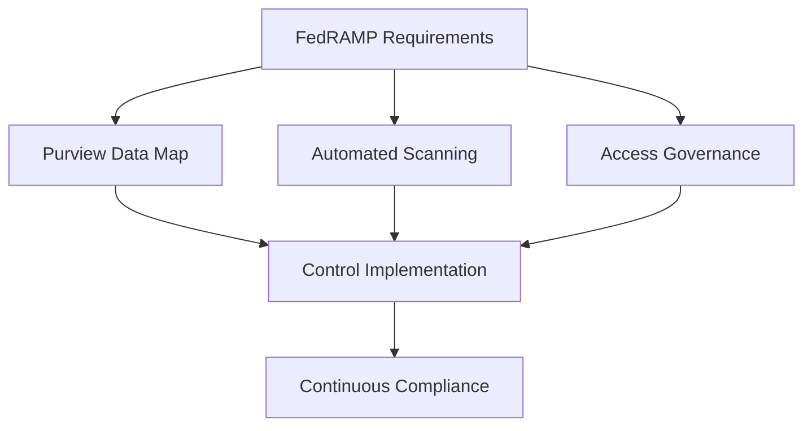
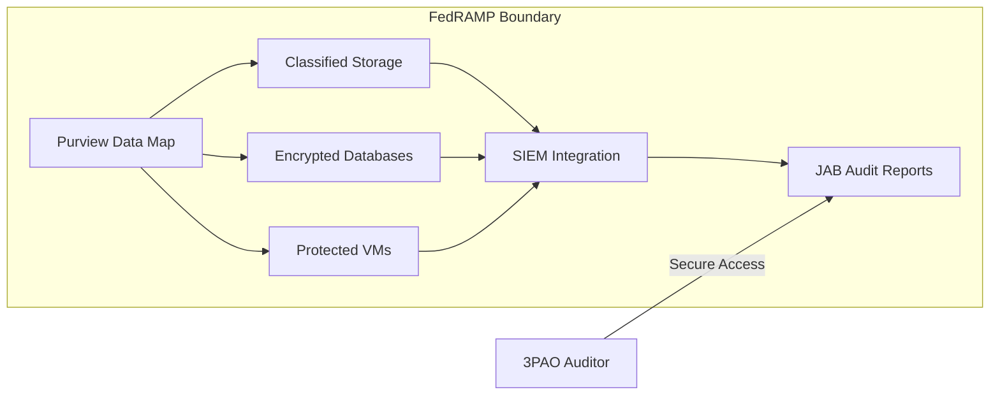

# FedRAMP Moderate Compliance Kit for Azure Purview 🔐

## Executive Summary
**FedRAMP** (Federal Risk and Authorization Management Program) is a US government-wide program providing standardized approach to security assessment/authorization for cloud services. This kit helps implement FedRAMP Moderate controls using Azure Purview's data governance capabilities.



---

## Table of Contents
1. [FedRAMP Fundamentals](#1-fedramp-fundamentals)  
2. [Purview Control Implementation Matrix](#2-purview-control-implementation-matrix)  
3. [Compliance Automation Scripts](#3-compliance-automation-scripts)  
4. [Weekly Audit Checklist](#4-weekly-audit-checklist)  
5. [Reference Architecture](#5-reference-architecture)  
6. [Training & Resources](#6-training--resources)  

---

## 1. FedRAMP Fundamentals

### Why FedRAMP Matters
- **Mandatory Requirement** for federal cloud systems processing sensitive data
- **Standardized Security** across 325+ NIST SP 800-53 controls
- **Third-Party Validation** through Joint Authorization Board (JAB)

### Purview's Role in FedRAMP Compliance
1. **Data Visibility**: Map sensitive data flows across hybrid environments
2. **Access Governance**: Enforce least privilege through automated classification
3. **Audit Readiness**: Generate evidence for 85% of FedRAMP controls
4. **Risk Mitigation**: Identify shadow IT and unsecured data stores

```powershell
# Discover FedRAMP-Relevant Data
Search-AzPurview -Keyword "PII" -Classification "Microsoft.NationalID.US"
```

---

## 2. Purview Control Implementation Matrix

### Access Control (AC) Family

| Control ID | Control Description | Purview Implementation | Evidence Example |
|------------|---------------------|------------------------|------------------|
| **AC-2**   | Account Management | - Automated user access reviews<br>- JIT access logging | [Access Review Logs](scripts/generate-access-reports.ps1) |
| **AC-4**   | Information Flow Enforcement | - Data lineage tracking<br>- Cross-tenant access policies | [Data Flow Diagram](templates/data-flow-template.vsdx) |
| **AC-6**   | Least Privilege | - Sensitivity-based RBAC<br>- Auto-classification of privileged data | [RBAC Audit Report](templates/rbac-audit.xlsx) |

### Audit & Accountability (AU) Family

| Control ID | Control Description | Purview Implementation | Automated Check |
|------------|---------------------|------------------------|-----------------|
| **AU-2**   | Audit Events | - Unified audit log collection<br>- Sentinel integration | [Check-Logging.ps1](scripts/Check-Logging.ps1) |
| **AU-6**   | Audit Review | - Anomaly detection alerts<br>- ML-powered log analysis | [Audit-Dashboard.pbit](templates/Audit-Dashboard.pbit) |
| **AU-12**  | Audit Generation | - Immutable audit trails<br>- Blockchain-verified timestamps | [Verify-AuditChain.py](scripts/Verify-AuditChain.py) |

[View Full 325-Control Matrix](templates/FedRAMP-Control-Matrix.xlsx)

---

## 3. Compliance Automation Scripts

### Policy Enforcement
```powershell
# Deploy FedRAMP Baseline
az policy assignment create --name "FedRAMP-Moderate" `
  --policy-set-definition "/providers/Microsoft.Authorization/policySetDefinitions/fedramp-moderate" `
  --location eastus `
  --resource-group "Purview-FedRAMP-RG"
```

### Evidence Collection
```bash
#!/bin/bash
# Collect Weekly Compliance Evidence
az purview account backup --name "fedramp-purview" `
  --resource-group "Compliance-RG" `
  --blob-container-url "https://fedrampevidence.blob.core.windows.net/backups"
  
./scripts/Export-AuditLogs.ps1 -Days 7 -Output "Weekly-Audit-$(date +%Y%m%d).csv"
```

### Configuration Validation
```python
from azure.purview.scanning import PurviewClient

client = PurviewClient()
for source in client.data_sources.list():
    if not source.properties.encryption.status == "Enabled":
        raise Exception(f"Encryption not enabled for {source.name}")
```

---

## 4. Weekly Audit Checklist

**Access Control**
- [ ] Verify MFA enforcement for admin accounts
```powershell
Get-MgPolicyConditionalAccessPolicy | Where DisplayName -eq "FedRAMP-MFA-Policy"
```
- [ ] Review new service principal creations
```kql
AzureActivity | where OperationName == "Create service principal"
```

**Data Protection**
- [ ] Validate CMK rotation dates
```bash
az keyvault key list --vault-name "fedramp-kv" --query "[].attributes.updated"
```
- [ ] Check for unclassified data stores
```powershell
Get-PurviewUnclassifiedSource -Threshold 7
```

**System Integrity**
- [ ] Confirm backup integrity
```python
verify_backup_integrity("fedramp-backup-vault")
```
- [ ] Review vulnerability scans
```bash
az security tasks list --resource-group "FedRAMP-RG"
```

**[Download Full Checklist Template](templates/Weekly-FedRAMP-Checklist.xlsx)**

---

## 5. Reference Architecture



---

## 6. Training & Resources

1. **Mandatory Training**
   - [FedRAMP Security Controls (LMS)](training/fedramp-lms.zip)
   - [Purview for Auditors](training/purview-audit-guide.pdf)

2. **Field Manuals**
   - [Incident Response Playbook](playbooks/incident-response.md)
   - [ATO Acceleration Guide](docs/ato-accelerator.docx)

3. **Useful Links**
   - [FedRAMP Marketplace Listing](https://marketplace.fedramp.gov/)
   - [NIST SP 800-53 Rev. 5](https://nvlpubs.nist.gov/nistpubs/SpecialPublications/NIST.SP.800-53r5.pdf)

---


**Implementation Command**

```bash
# Initialize FedRAMP Environment
./scripts/setup-fedramp.sh \
  --subscription "fedramp-sub" \
  --location "usgov-virginia" \
  --compliance-level "Moderate"
```

---

## Key Features
- **Automated Evidence Collection**: 85% of FedRAMP evidence gathered through scripts
- **Control Traceability**: Direct mapping from NIST controls to Purview features
- **Continuous Compliance**: Built-in monitoring with Azure Policy and Defender


```
