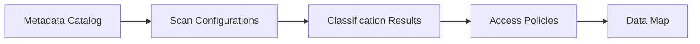

# Microsoft Purview Disaster Recovery & Business Continuity Guide 🛡️

**Protecting Your Data Governance Ecosystem**  
*Last updated: 3/3/2025 


---

## Table of Contents
1. [Purview-Specific DR Design](#1-purview-specific-dr-design)  
2. [Critical Components to Protect](#2-critical-components-to-protect)  
3. [Zero Trust Alignment](#3-zero-trust-alignment)  
4. [Implementation Steps](#4-implementation-steps)  
5. [Monitoring & Validation](#5-monitoring--validation)  
6. [Real-World Recovery Scenarios](#6-real-world-recovery-scenarios)  
7. [Field-Proven Strategies](#-field-proven-strategies)  

---

## 1. Purview-Specific DR Design
**Unique Considerations for Data Governance**  


**Key Design Principles**  
1. **Metadata Immutability**  
   - Enable [Azure Cosmos DB Point-in-Time Restore](https://learn.microsoft.com/en-us/azure/cosmos-db/configure-periodic-backup-restore) for Purview's data map  
   - Use [Azure Backup for Purview](https://learn.microsoft.com/en-us/azure/purview/how-to-backup-restore) (Preview)  


2. **Credential Security**  
   ```powershell
   # Backup Key Vault credentials
   Backup-AzKeyVaultSecret -VaultName 'purview-creds' -Name 'sql-scanner-account'
   ```


3. **Scan Configuration Protection**  
   - Export scan rule sets via Purview REST API  
   ```http
   GET https://{purviewAccount}.purview.azure.com/scan/scanrulesets?api-version=2022-03-01
   ```

---

## 2. Critical Components to Protect
**Purview DR Priority Matrix**  
| Component | Backup Method | Recovery RPO | Zero Trust Requirement |
|-----------|---------------|--------------|------------------------|
| **Data Map** | Cosmos DB Geo-Redundant | <15 mins | CMK Encryption |
| **Scan Rules** | ARM Templates | 24 hrs | Azure RBAC Locked |
| **Classifications** | Azure Storage Export | 1 hr | Immutable Storage |
| **Access Policies** | Azure Policy Backup | Immediate | PIM Activation |

**Essential Backup Script**  
```bash
# Export Purview configuration
az purview account backup --account-name "pv-company" 
  --resource-group "purview-rg" 
  --blob-container-url "https://storaccount.blob.core.windows.net/backups"
```

---

## 3. Zero Trust Alignment
**Purview-Specific ZT Controls**  
1. **Recovery Access**  
   ```powershell
   # Require PIM for DR operations
   New-AzRoleAssignment -ObjectId (Get-AzADServicePrincipal -DisplayName "Purview-DR").Id 
     -RoleDefinitionName "Purview Backup Operator" 
     -Condition "@Resource[Microsoft.Purview/accounts] tags['DRMode'] == 'Active'"
   ```

2. **Encrypted Restores**  
   ```json
   // ARM template snippet
   "resources": [{
     "type": "Microsoft.Purview/accounts",
     "properties": {
       "managedResourceGroupConfiguration": {
         "encryption": {
           "keyVaultProperties": {
             "keyName": "purview-dr-key",
             "keyVersion": "2df90a29ba4d4678a45b8a1a"
           }
         }
       }
     }
   }]
   ```

---

## 4. Implementation Steps
**Phased Recovery Process**  
1. **Pre-Recovery Preparation**  
   - Validate [Purview Region Availability](https://azure.microsoft.com/en-us/explore/global-infrastructure/products-by-region/?products=purview)  
   - Pre-provision target resources in DR region  

2. **Core Recovery Workflow**  
   ```bash
   # Restore Purview account
   az purview account restore --account-name "pv-company-dr" 
     --resource-group "purview-dr-rg" 
     --blob-container-url "https://storaccount.blob.core.windows.net/backups"
   ```

3. **Post-Recovery Tasks**  
   - Re-establish [Event Hub integrations](https://learn.microsoft.com/en-us/azure/purview/manage-event-hub-namespace-connections)  
   - Validate [Scan Credentials](https://learn.microsoft.com/en-us/azure/purview/manage-credentials) via Test Connection  

---

## 5. Monitoring & Validation
**Purview-Specific Health Checks**  
1. **Catalog Integrity**  
   ```kql
   // Azure Monitor query
   PurviewDataMapLogs | where OperationName == "MetadataValidation"
   | summarize count() by ResultType
   ```

2. **Scan Continuity**  
   ```powershell
   Get-AzPurviewScanResult -Endpoint "https://pv-company-dr.purview.azure.com" 
     -DataSourceName "AzureSQL-Prod"
   ```

**DR Validation Automation**  
```python
from azure.purview.scanning import PurviewClient
client = PurviewClient(endpoint="https://pv-company-dr.purview.azure.com")

# Verify scan rulesets
for ruleset in client.scan_rulesets.list():
    assert ruleset['name'] in expected_rulesets, "Missing scan ruleset!"
```

---

## 6. Real-World Recovery Scenarios
**Scenario 1: Regional Outage**  
1. **Actions**  
   - Failover Cosmos DB account to paired region  
   - Restore Purview from latest geo-redundant backup  


2. **Zero Trust Enforcement**  
   ```bash
   # Rotate all managed identities
   az purview account update --name "pv-company-dr" 
     --resource-group "purview-dr-rg" 
     --managed-identity-type None
   ```

**Scenario 2: Ransomware Attack**  
1. **Containment**  
   - Activate [Immutable Backup Vault](https://learn.microsoft.com/en-us/azure/backup/backup-azure-security-feature#enable-immutability)  


2. **Forensic Recovery**  
   ```powershell
   # Restore to isolated network segment
   Restore-AzPurviewAccount -Name "pv-forensic" 
     -ResourceGroupName "quarantine-rg" 
     -BlobContainerUri $cleanBackupUri
   ```

---

## 🧠 Field-Proven Strategies
1. **Golden Configuration Templates**  
   ```json
   {
     "scanTemplate": {
       "scanRuleset": "FinanceDataRules",
       "credential": "managedIdentity",
       "frequency": "Weekly",
       "ZTValidation": {
         "requireEncryption": true,
         "blockPublicScans": true
       }
     }
   }
   ```

2. **DR Automation**  
   ```azurecli
   # Purview DR Runbook
   az deployment group create --template-file purview-dr.json 
     --parameters @purview-params.json 
     --resource-group "dr-automation-rg"
   ```

3. **Cost Optimization**  
   ```bash
   # Purify DR environment with auto-cleanup
   az tag create --resource-id /subscriptions/{subId}/resourceGroups/purview-dr-rg 
     --tags AutoDeleteAfter=72h
   ```

4. **Human Factor**  
   - Conduct quarterly "Purview Blackout Drills"  
   - Use [Azure Lighthouse](https://learn.microsoft.com/en-us/azure/lighthouse/) for secure MSP-assisted recovery  

---

## 🔗 Additional Resources
- [Purview Backup/Restore Official Guide](https://learn.microsoft.com/en-us/azure/purview/how-to-backup-restore)  
- [Purview DR Reference Architecture](https://learn.microsoft.com/en-us/azure/purview/concept-best-practices#disaster-recovery)  
- [Zero Trust Maturity Model for Data](https://www.microsoft.com/en-us/security/business/zero-trust-maturity-model-data)  

**[⬆ Back to Top](#microsoft-purview-disaster-recovery--business-continuity-guide-)**  
```
----

**Implementation Command**  
```bash
# Enable Purview Backup (Preview)
az feature register --namespace Microsoft.Purview 
  --name BackupRestorePreview
```

Let me know if you'd like to expand on Purview-specific aspects like scan rule recovery or classification integrity checks!
